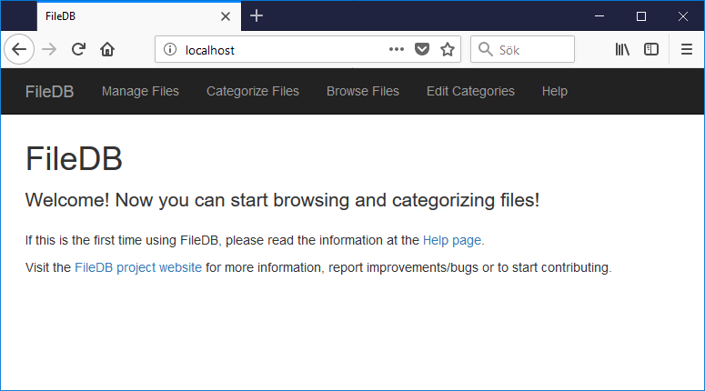

# README #

**Note:** this project has been replaced by [filedb2](https://github.com/ponmar/filedb2) and is no longer maintained.

## About ##

This is a project for storing, maintaining and presenting meta-data (persons, locations and tags) for files. A typical use case is to make a picture and video collection searchable and for running slideshows.

FileDB provides a server application, a web application and an API for performing tasks from other applications.

FileDB pros:

* Own your data: No data is shared with other parties
* Control your data: All data is stored in an SQLite database and may be converted for future use depending on your future needs (no lock-in effect)
* Search cababilities: Find files given a basic search criteria. Combine basic search criterias for creating an advanced search criteria
* Present extra statisticts: People age, etc are presented when browsing files
* 3rd party software integrations: Data may be exported to be used by other software and there is also an API to be used by custom software
* Open source: Contributions and feedback are welcome!

FileDB cons:

* Categorizing files is a bit time consuming. However, the web application tries to make this process as simple as possible. Competing cloud services usually identifies persons automatically with face recognition, but that feature is not implemented in FileDB.

### Server ###

The FileDB server application is the interface towards the internal database that stores the file meta-data. It is implemented in Python and based on the Flask framework. The server uses one configuration file that, for example, points out the file collection root directory.

### Web Application ###

The FileDB web application is tha main GUI. The web application should be able to run in most up-to-date browsers. It is used to update file meta-data in by using the server application API. It consists on a number of HTML pages that are generated by the server application and Javascript code to allow dynamic pages.

*The FileDB webapp start page.*

### API ###

The API is provided by the server application. It allows the web application, or any other custom application, to fetch and update file meta-data. Some util applications are included to show how the API can be used from Python.

## Getting Started ##

### Prerequisites ###

Note that it is recommended to have a backup procedure for your file collection before running FileDB (although FileDB itself does not modify your files).

FileDB prerequisites:

- [Python](https://www.python.org/) (version 3.4 or later)
- [Flask](http://flask.pocoo.org/) (a web framework for running server-side code):

        pip install flask

- [Pillow](https://python-pillow.org/) (for reading date, time and GPS location information from JPEG images and for generating thumbnails):

        pip install pillow

- Optional: [PyChromecast](https://github.com/balloob/pychromecast) (for streaming to Google Chromecast compatible devices on the local network)

        pip install PyChromecast

### Download ###

Download a specific release by finding the latest tag [here](https://bitbucket.org/pontusmarkstrom/filedb/downloads/?tab=tags).

Advanced users may select one of the available branches. The dev branch is used during development and may contain unfinished work. When stable and tested, the dev branch is merged to the master branch (with an up-to-date changelog) and a version tag is set.  

### Installation ###

This chapter describes how to install FileDB from scratch (no upgrade).

- Download and fix the prerequisites (see above)
- Edit configuration for your needs (see config.py)
- Create the database:

  **Warning!** This command removes all existing data from the FileDB database (don't run this command when the database is populated later).

        python runserver.py --initdb

- Decide your backup policy for your FileDB data (filedb.db)

### Upgrading ###

This chapter describes how to upgrade from an earlier version of FileDB.

- Download a new FileDB version to a new directory
- Check changelog for version specific upgrade instructions (may be provided when major version number is stepped)
- Edit configuration for your needs (see config.py)
- Copy your data (filedb.db) from the old FileDB directory to the new one

Note that the database format should not be changed in future FileDB revisions, but the configuration file (config.py) may be changed.

### Starting the FileDB Server ###

This section describes how to start the FileDB server with the Flask built-in HTTP server. Note that it is also possible to [deploy Flask applications (FileDB) to a WSGI server](http://flask.pocoo.org/docs/0.12/deploying/#deployment) (not yet tested).

Print help:

    python runserver.py --help

Start the server:

    python runserver.py

Note that your OS can be setup to run this command at startup. How to do this depends on your OS.

### Accessing the Web Application and the API ###

Open [http://localhost](http://localhost) in a browser. Note that the port may vary depending on your configuration. The web application may also be reached from the network via an external IP address if configured so.

The API is accessed via the same web server as the web application. See the included [API documentation](API.html) for more details. See API example usage in the utils directory.

### Documentation ###

The release contains the following documentation:

* This README
* [Changelog](CHANGES.html)
* [API documentation](API.html)
* Web application help page (FileDB must be running to make it accessible)
* [Development notes](DESIGN.txt)

## Contribute ##

So far this project has been developed by me, Pontus Markstrom, and I would love to see that change both regarding number of developers and users. Feel free to contribute!

## Licenses ##

This project uses the [MIT license](LICENSE.txt).

[jQuery](http://jquery.com/) is used by the web application for Ajax calls and DOM updates. It uses the [MIT license](https://jquery.org/license/).

[Bootstrap](http://getbootstrap.com) is used by the web application for GUI layout. It uses the [MIT license](https://v4-alpha.getbootstrap.com/about/license/).
